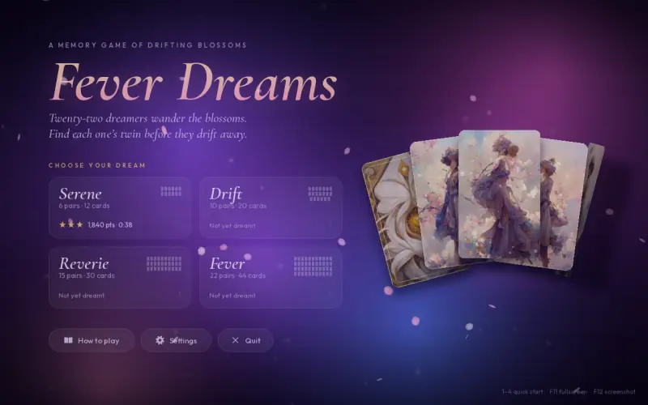
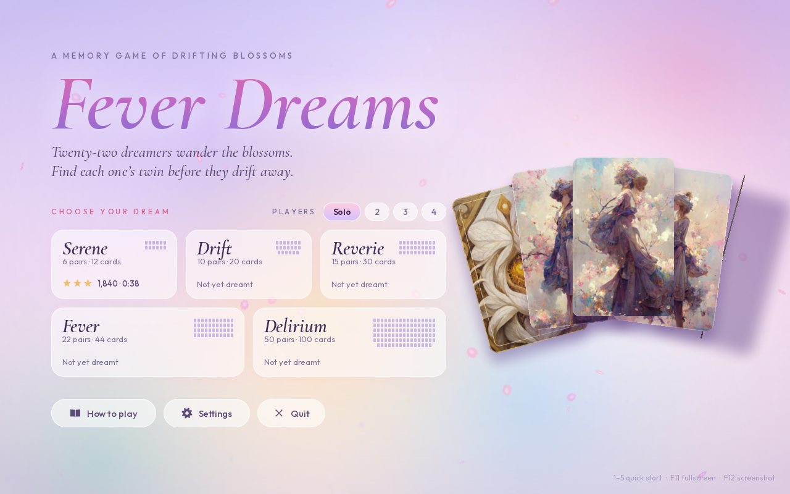
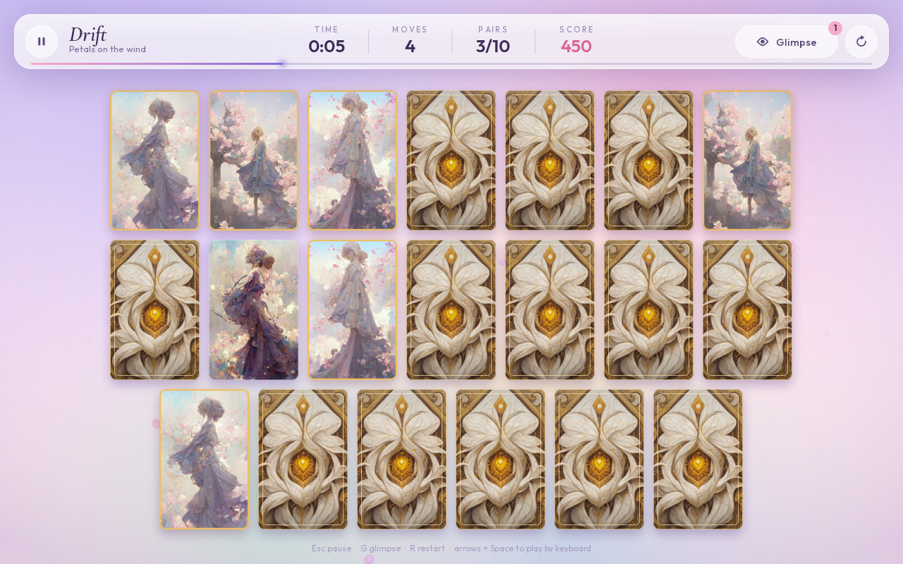
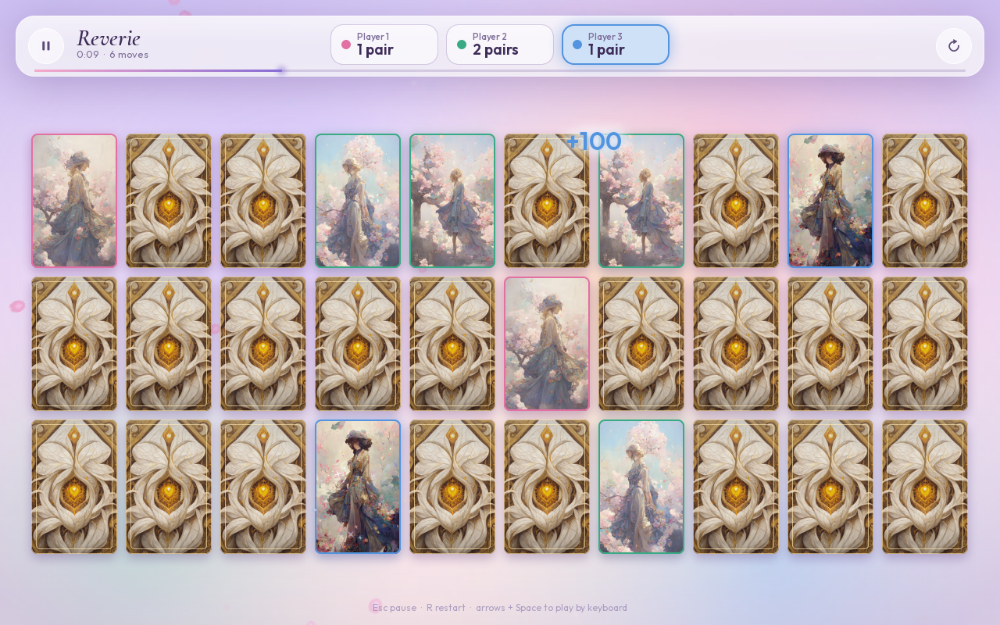
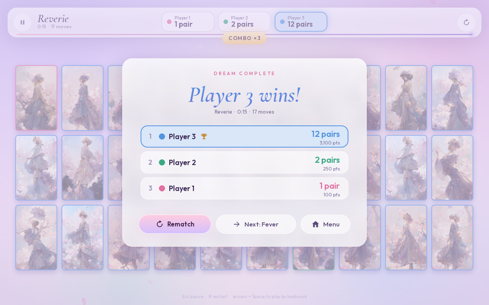
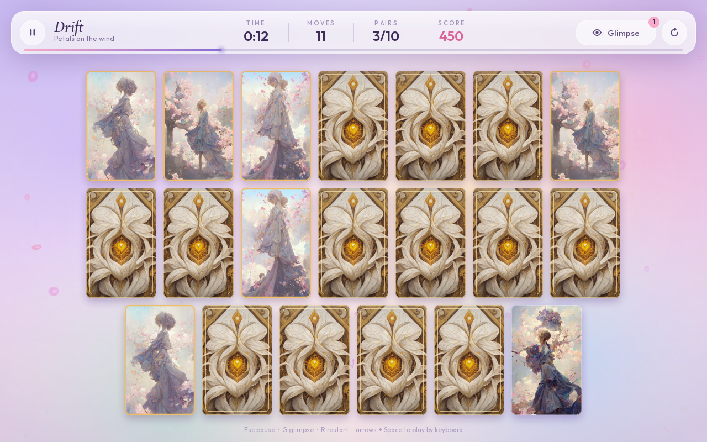
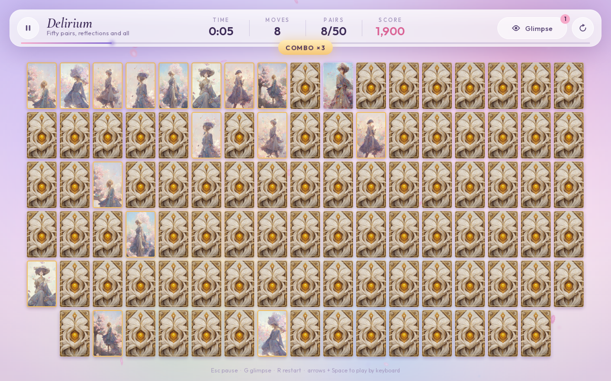

<div align="center">

# Fever Dreams

*A memory game of drifting blossoms.*

Twenty-two painted dreamers wander through cherry blossoms, and every one of them looks
almost like the others. Turn the cards, find each dreamer's twin, and chase a perfect run
on your own, or take turns with up to three friends.



</div>

<p align="center">
  
  
</p>
<p align="center">
  
  
</p>
<p align="center">
  
  
</p>

## Play

You need Python 3.10 or newer.

```bash
pip install -r requirements.txt
python -m fever_dreams
```

Or install it as a command:

```bash
pip install .
fever-dreams            # --fullscreen, --windowed, --seed N
```

> The game uses [pygame-ce](https://pyga.me), which installs under the same `pygame`
> import name as classic pygame. If you have classic pygame installed, run
> `pip uninstall pygame` first.

## How to play

Turn over two cards at a time. Matching dreamers stay revealed; the rest drift back
face down. You never have to wait out a wrong guess: click another card and play on.

| Dream    | Pairs | Cards | Par time |
|----------|------:|------:|---------:|
| Serene   |     6 |    12 |     1:00 |
| Drift    |    10 |    20 |     2:00 |
| Reverie  |    15 |    30 |     3:30 |
| Fever    |    22 |    44 |     6:00 |
| Delirium |    50 |   100 |    15:00 |

There are 22 illustrations, so **Delirium** also deals each dreamer's mirror image and a
close-up portrait. Every face has exactly one twin, but you'll need a sharp eye.

**Playing together.** Choose 2, 3 or 4 players on the title screen for a pass-and-play
game on one screen. Finding a pair earns another turn; a miss passes the turn to the
next player. Each player has a colour, matched pairs are framed in the colour of whoever
found them, and the player with the most pairs wins (ties are shared). Glimpse is
solo-only, and hot-seat games don't affect your solo records.

**Scoring.** Each pair is worth 100 points. Matching pairs back to back builds a combo
worth +0.5x per match, up to 3x. Finishing under par earns 10 points for every second
to spare. Stars are based on moves: up to 1.75 moves per pair earns three stars, up
to 2.5 earns two.

**Glimpse.** Once per game you can reveal every card for a moment. It costs 250 points.

Your best score, time, moves and stars for each dream are saved automatically, along
with your settings.

### Controls

| Action                    | Mouse              | Keyboard                     |
|---------------------------|--------------------|------------------------------|
| Turn a card               | Click              | Arrows / WASD, then Space    |
| Glimpse                   | Eye button         | `G`                          |
| Restart                   | Restart button     | `R`                          |
| Pause                     | Pause button       | `Esc` or `P`                 |
| Quick start a dream       |                    | `1` to `5` on the title      |
| Fullscreen                |                    | `F11` or `Alt+Enter`         |
| Screenshot                |                    | `F12`                        |

The game also pauses itself when the window loses focus.

## What's inside

- **3D card flips** with lift, shading and soft shadows, a hover glow, a gold halo and
  sparkle burst on every match, and a shake when a guess goes wrong.
- **A soft pastel palette** drawn from the art: a lavender-to-blush sky, drifting pastel
  light, tumbling sakura petals and twinkling motes. You can turn the petals off in
  Settings.
- **Frosted-glass interface**: live-blurred white panels, animated stats, a combo badge
  and a progress rail.
- **Hot-seat multiplayer** for up to four players, with per-player colours, a turn
  banner and a standings screen.
- **Procedural sound.** Bell chimes that climb in pitch with your combo, paper-soft
  flips and a winning arpeggio, all synthesised at start-up with no audio files.
- **Responsive layout.** Resize the window or go fullscreen and the board re-flows to
  the largest cards that fit.
- **Full keyboard support**, with a visible focus ring.

## Project layout

```
fever_dreams/
  logic.py        game rules: flips, matching, streaks, scoring (no pygame, fully tested)
  layout.py       fits N cards of a fixed aspect ratio into any window
  storage.py      settings and records as JSON in your user data folder
  app.py          window, main loop, scene cross-fades, global keys
  scenes/         title screen, board, pause and results dialogs (solo and hot-seat)
  cards.py        card animation (flip, lift, shake, deal, match pulse)
  background.py   aurora, petals and motes
  particles.py    sparkles, glow rings, petal bursts, floating score text
  widgets.py      buttons, toggles, glass panels, keyboard focus
  gfx.py          anti-aliased shapes, gradients, glows, text, vector icons
  audio.py        synthesised sound effects
  assets/         card art and bundled fonts
tests/            unit tests plus headless end-to-end games
tools/            screenshot and preview generator
```

Records are stored in `~/.local/share/fever-dreams` on Linux,
`~/Library/Application Support/fever-dreams` on macOS and `%APPDATA%\fever-dreams` on
Windows. Set `FEVER_DREAMS_HOME` to use another folder.

## Development

```bash
pip install -e ".[dev]"
pytest                                   # unit + headless end-to-end tests
ruff check . && ruff format --check .
python tools/capture_screenshots.py      # regenerate docs/screenshots
```

## From notebook to game

This started life as a Tkinter game in a Jupyter notebook, written while I was learning
Python. The rewrite fixes everything that audit turned up:

- **Clicking during a check misbehaved.** `update()` calls inside the flip code ran queued
  clicks mid-check, so a third card could turn over while a pair was being compared,
  tripping the "You shall not flip more than 2 cards!!!" guard. The rules now live in a
  pure, tested `MemoryGame` class, and a third click simply resolves the pending pair.
- **Every wrong guess froze the window.** `sleep(1)` ran on the UI thread. Mismatches now
  resolve on a timer, or instantly when you keep playing.
- **Cards shared one global size.** `new_width` and `new_height` were module globals, so
  every card was redrawn at whichever card had resized last. Images were also stretched
  out of proportion, and the back and front art had different aspect ratios.
- **State leaked between games.** Switching difficulty mid-flip carried over flipped
  cards and counters, and you couldn't replay the same difficulty at all.
- **Confusing difficulties, oversized windows.** "Basic", "Simple" and "Easy" all meant
  easy, with "Easy" the hardest. Cards were fixed at 200x400 px, so "Simple" opened a
  2622 px wide window and "Easy" a 2190x1745 one. There was no timer, move counter,
  pause, restart or saved best, and the only reward was a message box.
- Globals scattered across notebook cells, unused imports (`sv_ttk`, `pprint`), paths
  that only worked from one folder, and no tests or packaging.

The original notebook is in the git history (commit `d3a2130`).

## Credits

- Card art comes from the original project.
- Fonts: [Cormorant Garamond](https://github.com/CatharsisFonts/Cormorant) and
  [Outfit](https://github.com/Outfitio/Outfit-Fonts), both under the SIL Open Font
  License (see `fever_dreams/assets/fonts/OFL.txt`).
- Built with [pygame-ce](https://pyga.me).

Code is released under the [MIT License](LICENSE).
